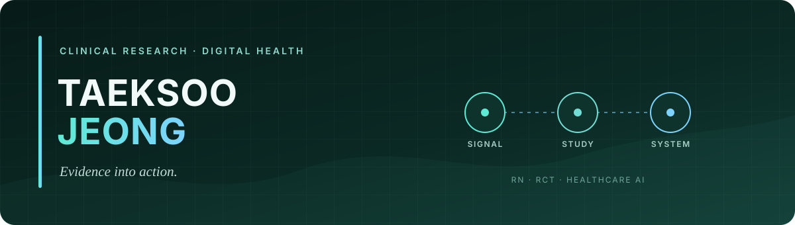

  

  <samp>
    <a href="https://jeongtaeksoo.github.io/">PORTFOLIO</a> ·
    <a href="https://jeongtaeksoo.github.io/#publications">PUBLICATIONS</a> ·
    <a href="https://www.linkedin.com/in/taeksoo-jeong-20685b296/">LINKEDIN</a> ·
    <a href="mailto:jeongtaeksoo8@gmail.com">EMAIL</a>
  </samp>

## Clinical evidence should move, not sit in a PDF.

I am **Taeksoo Jeong (정택수), RN** — a clinical research operator and digital health builder. I connect hospital workflows, study protocols, data operations, and AI prototypes so healthcare ideas can be tested in real settings.

My work centers on **cognitive care for older adults**, **multi-center clinical research**, and **responsible healthcare AI**.

<table width="100%">
  <tr>
    <td width="33%" align="center"><strong>2</strong> CRIS-registered RCT operations</td>
    <td width="33%" align="center"><strong>5</strong> peer-reviewed papers</td>
    <td width="33%" align="center"><strong>CTC</strong> Coach · Teacher · Companion framework</td>
  </tr>
</table>

### Current focus

- Designing clinically testable AI interactions for older adults
- Translating research protocols into accessible product workflows
- Building evidence trails that connect claims, code, and validation

## Selected research

| Year | Work | Role |
| :--- | :--- | :--- |
| 2025 | [A Generative AI Framework for Cognitive Intervention in Older Adults](https://doi.org/10.3390/healthcare13243225) · *Healthcare* | Co-first author |
| 2026 | [AI-driven telerehabilitation for older adults with mild cognitive impairment](https://doi.org/10.3389/fneur.2026.1813694) · *Frontiers in Neurology* | Co-author · RCT |
| 2025 | [AI-driven cognitive telerehabilitation for stroke](https://doi.org/10.3389/fneur.2025.1636017) · *Frontiers in Neurology* | Co-author · multicenter RCT |
| 2025 | [AI-guided mobile telerehabilitation for cognitive impairment](https://doi.org/10.5535/arm.250060) · *Annals of Rehabilitation Medicine* | Co-author · feasibility study |

<a href="https://jeongtaeksoo.github.io/#publications">View the complete publication record →</a>

## Things I build

### 01 / [Context-Adaptive Cognitive Flow](https://github.com/jeongtaeksoo/context-adaptive-cognitive-flow)

A reproducible implementation of the Coach–Teacher–Companion framework, connecting cognitive load, adaptive difficulty, and emotionally aware interaction.

`Python` · `Generative AI` · `Cognitive Intervention`

### 02 / [RepoLens Code DNA](https://github.com/jeongtaeksoo/repolens-code-dna)

An evidence-first assessment tool that turns public repository signals into reviewable findings instead of opaque scores.

`TypeScript` · `AI Agents` · `Evidence Systems`

### 03 / [LUMI'S MIND ARCADE](https://github.com/jeongtaeksoo/lumi-mind-arcade)

A three-minute browser experience for attention, memory, pattern recognition, and directional sequencing.

`JavaScript` · `Cognitive Game` · `Accessible Web`

## How I work

> **Clinical signal → Study design → Testable system → Evidence**

| Clinical operations | Product translation | Technical prototyping |
| :--- | :--- | :--- |
| Multi-center coordination, protocol execution, research communication | Validation plans, user flows, safety and usability criteria | Python, TypeScript, JavaScript, React, Vite |

I am open to collaborations where **clinical validation and product execution need to move together**.

---

  <a href="https://jeongtaeksoo.github.io/">Portfolio</a> ·
  <a href="https://calendly.com/jeongtaeksoo8/30min">Coffee chat</a> ·
  <a href="mailto:jeongtaeksoo8@gmail.com">jeongtaeksoo8@gmail.com</a>

Evidence first · Human-centered · Built for real clinical settings

